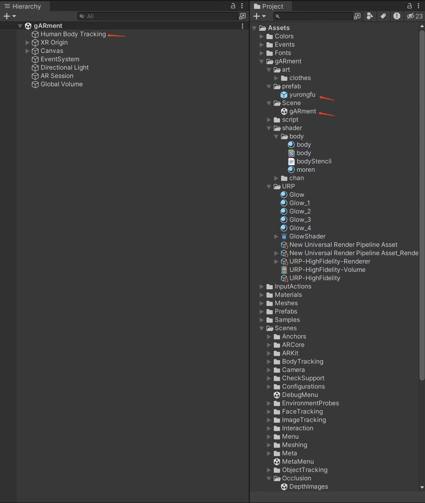

# gARment
## ------------RESONATOR studio------------
gARment is an AR wearable plug-in that only needs to import model data to achieve the effect of virtual wearing. It is necessary to understand and be able to perform basic 3D software bone-binding operation, and bind any model (shirt, hat, etc.) of your choice with the bones provided by us.

###### **The detailed operations are as follows.**

 1. Download the file **"Bone.fbx"** in the "Tutorials-and-Resources" branch.

 2. Bind your model to this skeleton in 3D software (such as blender) and export it in FBX format.

 3. Download the Unity Project files in the "Project-Documentation" branch and import the OBJ files you created earlier.

 4. Copy the prefab "yurongfu" in the **gARment/prefab** path, rename and open the replica, replace the child object "yurongfu" in the object "yurongfu" with the previously made FBX file, and make the garment roughly align with the human skeleton by changing the Transform.

 5. On the "Clo Control" script in the child "Controller" of the object "yurongfu", drag the child object of the corresponding name (that is, the skeleton corresponds to one of them) in the child object of the FBX file that you just replaced at the variable that does not contain the "Bot" prefix.

 6. Open the Scene "gARment" in the path **gARment/Scene**. Replace the **"SkeletonPrefab"** in the **"HumanBodyTracker"** component of the **"HumanBodyTracking"** object with the replica made in Step 4 and 5.

 7. Build and run the program on supported iPhone devices **(12 and above, and Pro)**.
